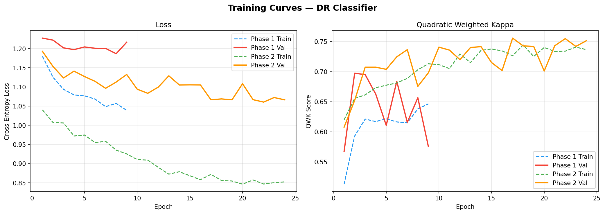
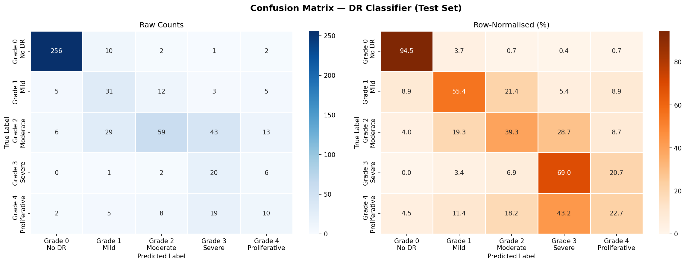

# Diabetic Retinopathy Detection using Deep Learning

## Overview
This project builds a deep learning model to detect diabetic retinopathy from retinal fundus images.

## Dataset
Dataset from Kaggle:
APTOS 2019 Blindness Detection 
https://www.kaggle.com/competitions/aptos2019-blindness-detection/data

IDRiD: Excellent for "Early Detection" as it provides pixel-level annotations for lesions.
https://www.kaggle.com/datasets/mohamedabdalkader/indian-diabetic-retinopathy-image-dataset-idrid2

## Project Structure
diabetic-retinopathy-detection/
│
├── data/
│   ├── raw/                # Original Kaggle retinal images
│   └── processed/          # Preprocessed images (resized, cleaned)
│
├── notebooks/
│   └── 01_data_exploration.ipynb   # Exploratory data analysis and dataset inspection
│
├── src/
│   ├── data_preprocessing.py       # Image preprocessing pipeline
│   ├── dataset_loader.py           # PyTorch dataset class for loading images
│   ├── model.py                    # EfficientNetB4 model with custom classification head
│   ├── train.py                    # Training pipeline with two-phase transfer learning
│   └── evaluate.py                 # Model evaluation and performance metrics
│
├── models/                 # Saved trained model weights
│
├── results/
│   └── training_curves.png # Training and validation loss/accuracy plots
│
├── requirements.txt        # Python dependencies for the project
├── README.md               # Project documentation
└── .gitignore              # Files and folders ignored by Git

## Model
CNN / ResNet / EfficientNet

## Training Results

## Results
Accuracy	68.36%
Weighted Precision	73.88%
Weighted Recall	68.36%

## How to Run

git clone
pip install -r requirements.txt
python src/train.py