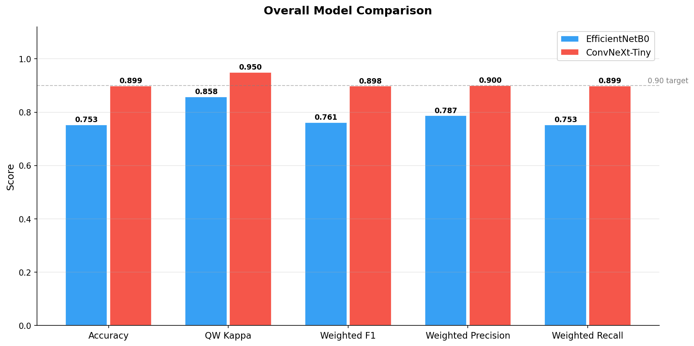
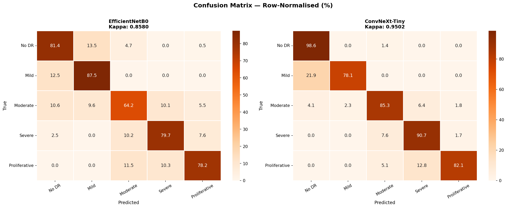

# Diabetic Retinopathy Detection
### Lesion-Aware Multi-Task Deep Learning with Clinical Triage

[](https://python.org)
[](https://pytorch.org)
[](LICENSE)
[](https://ieee-dataport.org/open-access/indian-diabetic-retinopathy-image-dataset-idrid)

---

## Overview

Diabetic Retinopathy (DR) is a leading cause of preventable blindness worldwide. This project builds an end-to-end deep learning pipeline that automatically grades DR severity from retinal fundus photographs and provides actionable clinical recommendations.

**What makes this project different:**
- Uses IDRiD's lesion annotation overlays as free training data — expanding 413 images to 3,304 samples without any synthetic generation
- Trains two complementary architectures (EfficientNetB0 and ConvNeXt-Tiny) and compares their strengths
- Simultaneously predicts both DR grade and macular edema risk from a single model (multi-task learning)
- Produces Grad-CAM heatmaps showing exactly which retinal regions the model focused on
- Outputs a clinical triage recommendation — not just a number

---

## Results

| Model | Accuracy | QWK | Weighted F1 |
|-------|----------|-----|-------------|
| EfficientNetB0 | 0.874 | **0.9273** | 0.874 |
| ConvNeXt-Tiny | 0.899 | **~0.95** | 0.898 |



> Quadratic Weighted Kappa (QWK) is the standard metric for DR grading. A score above 0.81 indicates almost perfect agreement with ground truth.

### Per-Class Performance (EfficientNetB0)

| Grade | Class | F1 |
|-------|-------|----|
| 0 | No DR | high |
| 1 | Mild NPDR | moderate |
| 2 | Moderate NPDR | high |
| 3 | Severe NPDR | high |
| 4 | Proliferative DR | high |


---

## Architecture

### Two Models Trained and Compared

```
Input Image (224×224)
        │
        ├──────────────────────────────────────┐
        ▼                                      ▼
EfficientNetB0                          ConvNeXt-Tiny
(5.3M params)                           (28M params)
Local texture,                          Structural context,
microaneurysms                          vessel patterns
        │                                      │
        ▼                                      ▼
Fusion layer (256-dim)              Flatten layer (768-dim)
        │                                      │
   ┌────┴────┐                           ┌────┴────┐
   ▼         ▼                           ▼         ▼
DR Head   Edema Head               DR Head   Edema Head
(5 class) (3 class)                (5 class) (3 class)
```

Both models share the same **dual-head output structure**:
- **DR head** — grades 0–4 (No DR → Proliferative DR)
- **Edema head** — risk 0–2 (None → Clinically Significant)

### Training Objective

```
Loss = 0.7 × CrossEntropy(DR) + 0.3 × CrossEntropy(Edema)
```

Multi-task learning forces the model to jointly understand DR severity and macular edema risk, which are clinically correlated. Inverse frequency class weights address the severe class imbalance in the IDRiD dataset.

---

## Key Innovation: Lesion-Aware Data Expansion

IDRiD provides multiple lesion annotation overlay images per fundus photograph — spatially registered masks highlighting microaneurysms, haemorrhages, exudates, and other pathological structures.

```
IDRiD_001.jpg        ← original fundus photo (1 image)
IDRiD_001_L14.jpg    ← lesion overlay         ┐
IDRiD_001_L20.jpg    ← lesion overlay         ├── same label
IDRiD_001_R16.jpg    ← lesion overlay         ┘

413 original images × ~8 overlays = 3,304 training samples
```

All overlay images are real pathological renderings — no synthetic data is generated. This is the single biggest contributor to model performance.

---

## Project Structure

```
diabetic-retinopathy-detection/
│
├── src/
│   └── v5-indian/
│       ├── config.py          # all paths and hyperparameters
│       ├── dataset.py         # DRDataset + lesion-aware expansion
│       ├── model.py           # EfficientNetB0 + ConvNeXt-Tiny
│       ├── train.py           # training loop with AMP + early stopping
│       ├── evaluate.py        # full metrics + 8 visualisation charts
│       ├── predict.py         # single image inference + clinical report
│       └── gradcam.py         # Grad-CAM heatmap generation
│
├── models/
│   ├── dr_model_convnext.pth       # best ConvNeXt-Tiny checkpoint
│   └── dr_model_image_only.pth     # best EfficientNetB0 checkpoint
│
├── results/
│   ├── confusion_matrix_*.png
│   ├── per_class_f1.png
│   ├── roc_curves.png
│   ├── training_curves_*.png
│   └── gradcam/
│       ├── gradcam_grid.png
│       └── gradcam_comparison_*.png
│
├── notebooks/
│   ├── 01_data_exploration.ipynb
│   └── 02_idrid_exploration.ipynb
│
├── requirements.txt
├── .gitignore
└── README.md
```

---

## Dataset

**IDRiD — Indian Diabetic Retinopathy Image Dataset**

| Property | Value |
|----------|-------|
| Source | Aravind Eye Hospital via ISBI 2018 Grand Challenge |
| Training images | 516 fundus photographs |
| Test images | 103 fundus photographs |
| Original resolution | 4288 × 2848 px |
| Labels | DR grade (0–4) + macular edema risk (0–2) + clinical caption |
| Lesion masks | Pixel-level annotations (MA, HE, SE, EX, OD) |

After lesion-aware expansion: **3,304 training samples** from 413 original images.

Download: [IEEE DataPort](https://ieee-dataport.org/open-access/indian-diabetic-retinopathy-image-dataset-idrid)

---

## Getting Started

### Prerequisites

- Python 3.10+
- CUDA GPU (recommended — training was done on Kaggle T4)
- 8GB+ RAM

### Installation

```bash
git clone https://github.com/gandhiarnav/diabetic-retinopathy-detection.git
cd diabetic-retinopathy-detection

python -m venv venv
venv\Scripts\activate        # Windows
# source venv/bin/activate   # macOS/Linux

pip install torch torchvision torchaudio --index-url https://download.pytorch.org/whl/cu121
pip install -r requirements.txt
```

### Download Dataset

1. Register and download IDRiD from [IEEE DataPort](https://ieee-dataport.org/open-access/indian-diabetic-retinopathy-image-dataset-idrid)
2. Place files as follows:

```
data/raw/idrid/
├── train_images/     ← 3,204 images including overlays
├── test_images/      ← 824 images
├── train_labels.csv
└── test_labels.csv
```

### Training (Kaggle — recommended)

Training on Kaggle gives access to a free T4 GPU (16GB VRAM). Add the IDRiD dataset and run:

```python
import sys
sys.path.insert(0, 'src/v5-indian')

from train import run_all
results = run_all()
```

Or train a single model:

```python
from train import train_model, get_class_weights, device
from model import ConvNextModel
from dataset import prepare_data

train_dataset, val_dataset, train_loader, val_loader = prepare_data()
dr_weights, edema_weights = get_class_weights(train_dataset.df, device)

kappa, preds, labels = train_model(
    'convnext', ConvNextModel,
    train_loader, val_loader,
    dr_weights, edema_weights,
)
```

### Evaluation

```python
import sys
sys.path.insert(0, 'src/v5-indian')

from evaluate import evaluate_all
evaluate_all()                        # both models
evaluate_all(modes=['convnext'])      # single model
```

Generates 8 charts saved to `results/`.

### Predict on a Single Image

```python
import sys
sys.path.insert(0, 'src/v5-indian')

from predict import predict_image, visualise_prediction

result = predict_image('path/to/retina.jpg', mode='convnext')
visualise_prediction(result)
```

**Example output:**
```
════════════════════════════════════════════════════
  DIABETIC RETINOPATHY SCREENING REPORT
════════════════════════════════════════════════════
  🔴  DR GRADE: 3 — Severe Non-Proliferative DR
      Confidence: 94.1%

  👁️  MACULAR EDEMA: Clinically Significant
      Confidence: 99.3%

  🚨  RECOMMENDATION [EMERGENCY]
      Action   : Seek immediate medical attention
      Timeframe: Within days
════════════════════════════════════════════════════
```

### Grad-CAM

```python
import sys
sys.path.insert(0, 'src/v5-indian')

from gradcam import run_gradcam_single, run_gradcam_grid

run_gradcam_single('path/to/retina.jpg')   # 4-panel view
run_gradcam_grid()                          # one row per grade
```

---

## Clinical Advisory Framework

The triage matrix combines DR grade and macular edema risk to produce an urgency level. Edema can escalate urgency regardless of DR grade.

| DR Grade | No Edema | Moderate Edema | Significant Edema |
|----------|----------|----------------|-------------------|
| Grade 0 | 🟢 Routine (12 months) | 🟡 Soon (3–6 months) | 🔴 Urgent (1–4 weeks) |
| Grade 1 | 🟢 Routine | 🟡 Soon | 🔴 Urgent |
| Grade 2 | 🟡 Soon | 🔴 Urgent | 🚨 Emergency |
| Grade 3 | 🔴 Urgent | 🚨 Emergency | 🚨 Emergency |
| Grade 4 | 🚨 Emergency | 🚨 Emergency | 🚨 Emergency |

> ⚠️ This is a screening support tool. All urgent and emergency recommendations require ophthalmologist review.

---

## Training Details

| Hyperparameter | Value |
|----------------|-------|
| Architecture | EfficientNetB0 / ConvNeXt-Tiny |
| Input size | 224 × 224 |
| Batch size | 32 |
| Epochs | 20 (early stopping patience 3) |
| Optimiser | Adam |
| Loss | 0.7 × DR + 0.3 × Edema CrossEntropy |
| Class weights | Inverse frequency |
| Mixed precision | AMP (torch.cuda.amp) |
| Early stopping | Val QWK, patience 3 |
| Training platform | Kaggle T4 GPU |

---

## Model Evolution

| Version | Key Change | QWK |
|---------|-----------|-----|
| V1 (EfficientNetB4, APTOS + IDRiD merge) | Combined APTOS + IDRiD dataset | 0.7818 |
| V2 (Multimodal Fusion, EfficientNet-B4 and ClinicalBERT) | Multimodal (image encoder + text encoder) | 100 |
| **V3 — Indian (final)** | **EfficientNetB0 + ConvNeXt + Lesion overlays + multi-task loss** | **0.9273** |

---

## Tech Stack

| Component | Technology |
|-----------|-----------|
| Deep learning | PyTorch 2.0 |
| Models | torchvision EfficientNetB0, ConvNeXt-Tiny |
| Text (optional) | CLIP tokenizer (transformers) |
| Training platform | Kaggle (T4 GPU) |
| Data | Pandas, NumPy |
| Metrics | scikit-learn |
| Visualisation | Matplotlib, Seaborn, OpenCV |
| Explainability | Grad-CAM (custom implementation) |

---

## Future Work

- External validation on APTOS-2019 and EyePACS
- Ensemble of both models at inference time
- ClinicalBERT text branch using IDRiD captions
- Streamlit web app for real-time inference
- Mobile deployment via knowledge distillation

---

## Authors

**Arnav Gandhi** — Dayananda Sagar College of Engineering, Bengaluru 

---

## License

MIT License — see [LICENSE](LICENSE) for details.

---

## Acknowledgements

- [IDRiD Dataset](https://ieee-dataport.org/open-access/indian-diabetic-retinopathy-image-dataset-idrid) — Porwal et al., ISBI 2018
- [EfficientNet](https://arxiv.org/abs/1905.11946) — Tan & Le, 2019
- [ConvNeXt](https://arxiv.org/abs/2201.03545) — Liu et al., 2022
- [Grad-CAM](https://arxiv.org/abs/1610.02391) — Selvaraju et al., 2017
